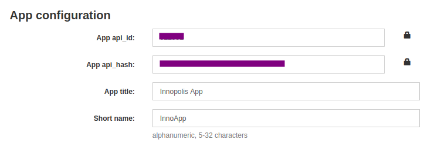

# Telegram bio updater

## What it does

1. With a given frequency, it updates your bio with [quotes](./src/quotes.py) of < 70 characters

1. Does not make you always `online`

## Run

1. You need your telegram `api_id` and `api_hash`.

   - Create your telegram app [here](https://my.telegram.org/apps)
   - Copy hash and id:
     
   - Do not share it with anyone!

1. [Install](https://docs.docker.com/engine/install/) Docker

1. Set it to [rootless mode](https://docs.docker.com/engine/security/rootless/)

1. Open a terminal

### Run via DockerHub

<ol start="5">
<li>
Create a directory and a file for settings

```sh
mkdir my_dir
cd my_dir
touch settings.env
printf '%s\n' \
  'API_ID=YOUR_API_ID_HERE'\
  'API_HASH=YOUR_API_HASH_HERE'\
  'PERIOD=UPDATE_PERIOD_IN_MINUTES'\
  > settings.env
```

</li>
<li>

Put your settings there

</li>

<li>
Pull the image and start docker in detached (`-d`) mode

```sh
docker pull dademd/bio-faker-tg
docker run -d --env-file settings.env dademd/bio-faker-tg
```

</li>

<li>
Find out the container name and follow its logs

```sh
$ docker container ls
CONTAINER ID   IMAGE                 COMMAND                  CREATED         STATUS         PORTS     NAMES
bb4bc01762ab   dademd/bio-faker-tg   "/bin/sh -c 'python …"   5 minutes ago   Up 5 minutes             magical_kirch
$ docker logs -f magical_kirch
```
</li>
</ol>


### Run from sources

<ol start="5">
<li>
Clone this repo

```sh
git clone https://github.com/br4ch1st0chr0n3/bio-faker-tg
cd bio-faker-tg
```

</li>
<li>
Copy template settings file

```sh
cp settings.template.env settings.env
```

</li>

<li>
Put your settings into `settings.env`
</li>

<li>
Start the app. You will have to establish a session. This will create a <tt>sessions/account1.session</tt> file. Using this file <b>everyone</b> can access your account. Do not share this file with anyone!

```sh
sh source_start.sh
```

</li>

</ol>

## References

- `python.analysis.diagnosticSeverityOverrides` (see [here](https://marketplace.visualstudio.com/items?itemName=ms-python.vscode-pylance)) to show import errors

- cache python packages: [src](https://pythonspeed.com/articles/docker-cache-pip-downloads/)

- docker variables: [src](https://vsupalov.com/docker-arg-env-variable-guide/)
